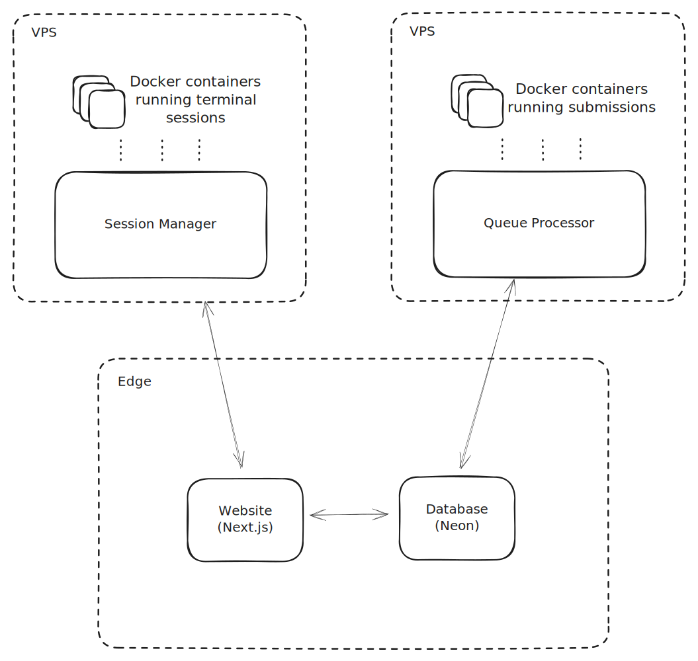

# easyshell - overview

**easyshell** is a platform for trying, learning and mastering shell commands. See it for yourself - [easyshell.xyz](https://easyshell.xyz).

## Quick Links

- [Overview](#easyshell---overview)
  - [Architecture and Features](#architecture-and-features)
    - [Website](apps/website/README.md)
    - [Queue Processor](apps/queue-processor/README.md)
    - [Session Manager](apps/session-manager/README.md)
    - [Entrypoint](apps/entrypoint/README.md)
- [Development Guide](#development-guide)
  - [Pre-Requisites](#pre-requisites)
  - [Environment Variables](#environment-variables)
  - [Scripts](#scripts)
  - [Problems](#problems)

## Architecture and Features

### Services

There are a few microservices that work together to make the platform work.

- #### Website

  Frontend for [easyshell.xyz](https://easyshell.xyz). See [Website](apps/website/README.md) for more information.

- #### Session Manager

  Manages the terminal sessions. See [Session Manager](apps/session-manager/README.md) for more information.

- #### Queue Processor

  Processes the submissions. See [Queue Processor](apps/queue-processor/README.md) for more information.

- #### Entrypoint

  Entrypoint for all testcase images. See [Entrypoint](apps/entrypoint/README.md) for more information.

---

## Development Guide

In this section,

- [Pre-Requisites](#pre-requisites)
- [Environment Variables](#environment-variables)
- [Scripts](#scripts)
- [Problems](#problems)

### Pre-Requisites

- Node (v22.14.0) and NPM (10.9.2) (can be installed using `nvm install 22`. see [nvm](https://github.com/nvm-sh/nvm))
- Go (1.23.6)
- Docker

### Environment Variables

The following environment variables might be required

- [`APP`](#app)
- [`PROJECT_ROOT`](#project_root)
- [`DOCKER_REGISTRY`](#docker_registry)
- [`DATABASE_URL`](#database_url)
- [`SESSION_MANAGER_URL`](#session_manager_url)
- [`NEXTAUTH_URL`](#nextauth_url)
- [`NEXTAUTH_SECRET`](#nextauth_secret)
- [`DISCORD_CLIENT_ID`](#discord_client_id)
- [`DISCORD_CLIENT_SECRET`](#discord_client_secret)
- [`GITHUB_CLIENT_ID`](#github_client_id)
- [`GITHUB_CLIENT_SECRET`](#github_client_secret)
- [`GOOGLE_CLIENT_ID`](#google_client_id)
- [`GOOGLE_CLIENT_SECRET`](#google_client_secret)

#### `APP`

This is a helper variable that is used to determine which environment variables to load and verify.
Possible values are - `queue-processor`, `website` and `script`.

#### `PROJECT_ROOT`

To run certain scripts, the _project root_ is automatically determined using `git rev-parse --show-toplevel` when within a git context. If running outside of one, please set the `PROJECT_ROOT` environment variable manually.

#### `DOCKER_REGISTRY`

Docker registry to use for pushing images. This is required for pushing images to the registry. If unset, the images will not be pushed.

If you are using a registry, then make sure you are already logged in.

#### `DATABASE_URL`

Database connection string. Set this to a NeonDB instance.

#### `SESSION_MANAGER_URL`

URL of the session manager. For cloudflare deployment, this cannot be a fixed IP address.

#### `NEXTAUTH_URL`

#### `NEXTAUTH_SECRET`

#### `DISCORD_CLIENT_ID`

#### `DISCORD_CLIENT_SECRET`

#### `GITHUB_CLIENT_ID`

#### `GITHUB_CLIENT_SECRET`

#### `GOOGLE_CLIENT_ID`

#### `GOOGLE_CLIENT_SECRET`

These are the [NextAuth](https://authjs.dev) configuration variables. These are **required** for running the Next.js application.

### Scripts

Many scripts have been defined in the [package.json](package.json).
This section will go over these scripts and the additional steps or environment variables required for their execution.

Also see [Next.js Scripts](apps/website/README.md#scripts), [Queue Processor Scripts](apps/queue-processor/README.md#scripts) and [Script Scripts](apps/script/README.md#scripts) for more information.

- [`lint:tsc`](#linttsc)
- [`lint:next`](#lintnext)
- [`format:check`](#formatcheck)
- [`format:write`](#formatwrite)
- [`problems:new`](#problemsnew)
- [`problems:lint`](#problemslint)
- [`problems:build`](#problemsbuild)
- [`problems:build-pkg`](#problemsbuild-pkg)

#### `lint:tsc`

Lint the entire TS/JS codebase using `tsc`.

#### `lint:next`

Lint the Next.js codebase using `next lint`.

#### `format:check`

Check formatting for the entire codebase using `prettier` and `gofmt`.

#### `format:write`

Format the entire codebase using `prettier` and `gofmt`.

#### `problems:new`

Create a new problem.

Might require the following environment variables.

- `APP=script`
- `PROJECT_ROOT` might need to be defined if the script is not run from within the git repository.

#### `problems:lint`

Lint the problem configuration files.

Might require the following environment variables.

- `APP` - This is required and should be set to `script`. Already set in [package.json](package.json).
- `PROJECT_ROOT` might need to be defined if the script is not run from within the git repository.

#### `problems:test`

Test the problem images using tests defined in the problem configs.

Might require the following environment variables.

- `APP` - This is required and should be set to `queue-processor`. Already set in [package.json].
- `PROJECT_ROOT` might need to be defined if the script is not run from within the git repository.

#### `problems:build`

Build (and push) the problem images.

Might require the following environment variables.

- `APP` - This is required and should be set to `script`. Already set in [package.json](package.json).
- `PROJECT_ROOT` might need to be defined if the script is not run from within the git repository.
- `DOCKER_REGISTRY` might need to be defined if the images need to be pushed to a registry.

#### `problems:build-pkg`

Next.js cannot dynamically import problems from the problems directory when deployed on the edge. A problems cache is generated containing only the information needed by the Next.js application. This command generates that cache.

Might require the following environment variables.

- `APP` - This is required and should be set to `script`. Already set in [package.json](package.json).
- `PROJECT_ROOT` might need to be defined if the script is not run from within the git repository.

### Problems

All problems for easyshell are stored in the [problems/](problems) directory. They have a strict structure, which dictates the problem's behaviour and affects its build process.

#### Problem Structure

- [`page.md`](#pagemd)
- [`hints/`](#hints)
- [`hints/<hint-id>.md`](#hintshint-idmd)
- [`testcases/`](#testcases)
- [`testcases/<testcase-id>/`](#testcasestestcase-id)
- [`config.ts`](#configts)

##### `page.md`

Explaination of the problem. For consistency, it should contain only two top-level headings - `Problem Statement` and `Instructions`.
This file is **required**.

##### `hints/`

Folder containing hints for the problem.
This folder is **optional**.

##### `hints/<hint-id>.md`

Hint for the problem. `<hint-id>` must begin from `1` and can only increase sequentially from there on.

##### `testcases/`

Folder containing testcases for the problem.
This folder is **required**.

##### `testcases/<testcase-id>/`

Folder containing the files for the testcase. `<testcase-id>` must begin from `1` and can only increase sequentially from there on.

At least one public testcase is required.

##### `config.ts`

This file contains the configuration for the problem. It is **required**.
